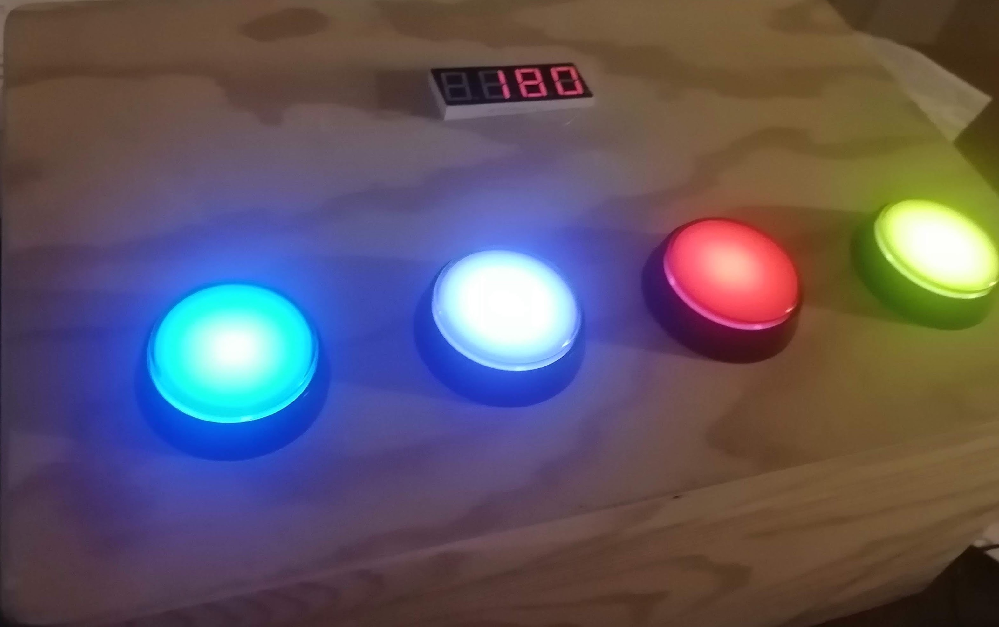

# spedenspelit
Kouluprojekti Spedenspeleistä.

# Versiot
Teimme kaksi versiota speden speleistä, joista ensimmäinen oli käsi käyttöinen, 7-segmenttinäytöillä pisteet esittävä versio.
Toiseen versioon koodattiin 4 osainen 7-segmenttinäyttö.

# Projektin tuotoksia

Alla olevasta kuvasta näkyy toinen tuotoksista.

# Osallistujat

[Jere Kortesalmi](https://github.com/JereKortesalmi) 
[Marko Oravisjärvi](https://github.com/Moravis) 
[Arto Peurasaari](https://github.com/artopeur) 
[Timo Pesola](https://github.com/timopesola) \< Jäämme kaipaamaan. >
